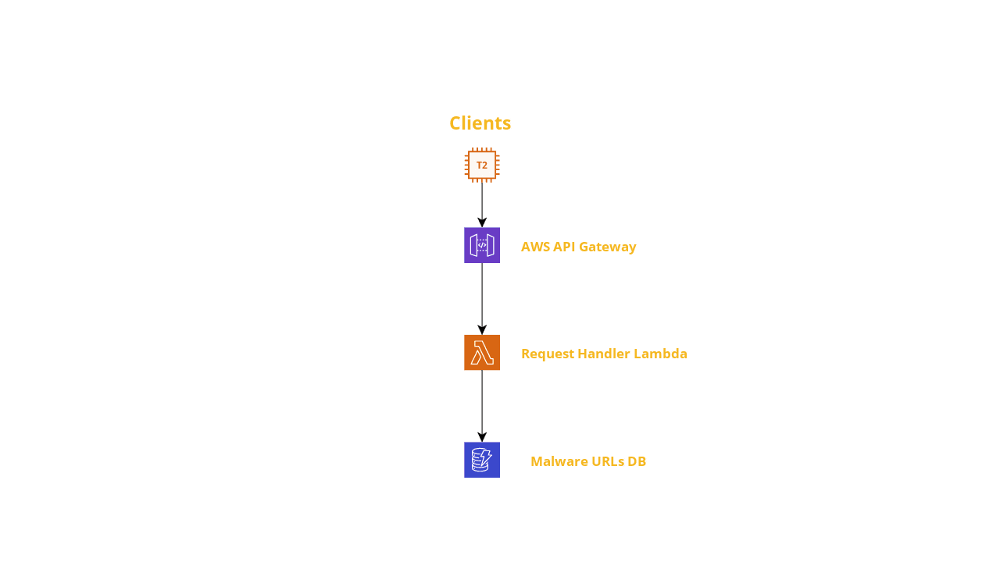

# URL Checker Service Lambda

This Lambda function acts as processor of two HTTP/JSON endpoints:

- URL Check
    - GET `{{base domain and path}}/v1/url-info/{{url-to-check-with-query-string}}`
    - Takes an HTTP GET request as an event from API Gateway.
    - Checks if the URL is found to be malicious. 
    - Replies with information about the URL with respect to the URL's inclusion in malware feeds.
    
- URL Submit
    - POST `{{base domain and path}}/v1/url-info`
    - Takes an HTTP POST request as an event from API Gateway.
    - Validates the POST body.
    - Stores information about the URL in a persistent database.
    - Responds with a success or a failure response.

## Test Drive a Deployed Instance of the Service

A test instance of the service is deployed at `https://zdn18ao2al.execute-api.us-east-2.amazonaws.com/test/v1/url-info`

**NOTE** :
This API is not publicly available and will require you to supply an API key
in the header `x-api-key`. \
To request an API key, send an email to the author kamal2311@gmail.com


**Checking an Unsafe URL:**

Request
```shell script
curl --location --request GET 'https://zdn18ao2al.execute-api.us-east-2.amazonaws.com/test/v1/url-info/bad-urls/1' \
--header 'x-api-key: <<API-Key>>' \
--header 'Content-Type: application/json'
```

Response
 ```json
{"is_safe":false,"source":"Malware Patrol","score":7}
```

**Checking a Safe URL:** 

Request
```shell script
curl --location --request GET 'https://zdn18ao2al.execute-api.us-east-2.amazonaws.com/test/v1/url-info/good-url' \
--header 'x-api-key: <<API-Key>>' \
--header 'Content-Type: application/json'
```

Response
```json
{
  "is_safe": true
}
```

**Submitting a New URL to the Malicious URLs DB:**

Request
```shell script
curl --location --request POST 'https://zdn18ao2al.execute-api.us-east-2.amazonaws.com/test/v1/url-info' \
--header 'x-api-key: <<API key>>' \
--header 'Content-Type: application/json' \
--data-raw '{
  "url": "bad-urls/1",
  "score": 7,
  "source": "Malware Patrol" 
}'
```
Response
```json
{
    "url": "bad-urls",
    "score": 7,
    "source": "Malware Patrol"
}
```


**NOTE:** For this simple service, we allow submitting only one URL in a single POST request.
For more practical use, we would change this service to accept a list of URLs and insert all of them in a batch process
for efficiency. We will likely also place a limit on the number of URLs that can be submitted in a single batch.

### Validations on the Submitted POST Body

- All the fields are mandatory.
- `score` must be an integer between 1 (inclusive) and 10 (inclusive).
- `source` must be a non-empty string no longer than 20 characters.  

## Checkout Code
```shell script
git clone git@github.com:kamal2311/url-checker-lambda.git
cd url-checker-lambda
```


## Run Tests
```shell script
# Set your AWS profile
export AWS_PROFILE=<<YOUR AWS ACCOUNT PROFILE>>
./scripts/run-tests.sh
``` 

## AWS Infrastructure 



- AWS API Gateway
- AWS Lambda proxy integration
- AWS Lambda function
- AWS Lambda execution role
- AWS Dynamo DB table
- AWS Cloudwatch logs and metrics

For this project, all these components were deployed using `AWS Console`.
Future iterations may leverage `AWS SAM CLI` or `CloudFormation` or `Terraform`.

Some level of automation has been implemented through the following shell scripts.
The following script will generate a lambda function and a DynamoDB table:

```shell script
# Set your AWS profile
export AWS_PROFILE=<<YOUR AWS ACCOUNT PROFILE>>
./scripts/deploy.sh
```


## Update Lambda Function Code
```shell script
# Set your AWS profile
export AWS_PROFILE=<<YOUR AWS ACCOUNT PROFILE>>
./scripts/redeploy.sh
``` 

## Design and Architecture Notes

- Ensuring Low Latency:
    - For the storage tier, we leverage a low latency, and infinitely scalable key value store for this (DynamoDB in this case).
    - For the front-end tier we use API Gateway for the following reasons:
        - API Gateway is a scalable serverless front-end that helps with concurrent requests with horizontal scalability.
        - Takes care of SSL termination for us, and our application code does not need to be burdened with extra CPU cycles spent in SSL connection.
        - We authorize requests with an API key that helps with rate limiting and usage analytics.
    
- Handling a Large Number of Requests:
    - API Gateway will scale up and down to accommodate for increase and decrease in traffic, keeping our infrastructure optimally utilized.
    - Operational burden becomes important at scale and this solution being serverless helps us greatly with very low operational burden.
    
- Handling a Large List of URLs:
    - For lists that cannot fit in memory, we need to use a persistent data store.
    - We have a very simple schema and a query pattern which is a good match for DynamoDB.
    - Dynamo DB is ideally suited for meeting the low-latency response at large scale because of its clever design.    
        
- Caching:
   - We can enable caching at the API Gateway layer itself further helping with lowering the latency.
   - We can also implement an in-memory cache with a hashmap and a queue to avoid making repeated requests to the database. 
    NOTE: for our application though, DynamoDB responses were so fast that caching made little difference to the response time.
    Our requests currently respond within ~400ms on the average, most of which is spent in SSL handshake and network connection.
   - Time spent in server processing is already in single/double digit milliseconds.
   - So, our choice to use an in-memory cache vs DynamoDB is essentially more of a cost trade-off than a latency trade-off.
       
- Choice of Golang:
   - Golang runtime has a fast cold start.
   - It has a small memory footprint which helps with lowering the cost of Lambda usage.
   - Program execution is fast.
   - Comes with built-in tools for unit testing.   
    
- Supporting URL Ingestion:
   - We expect ~5000 new urls a day arriving every 10 minutes.
   - Assuming each URL and metadata on the average is of size 500 bytes, we will need to handle a POST body load of (5000 / 24 * 6 ) = ~35 URLs every 10 minutes
    This is a small payload 35 * 500 bytes = 17.5 KB for every POST request and can be easily handled.
   - We will generate a SHA-1 hash of the URL to be stored in the DB along with its metadata (such as the source of intelligence and maliciousness score 
   on a scale of 1 to 10).
   - Since we don't do malware check ourselves, our service will simply store the item into the DynamoDB table.
   - If we need to do more processing on the URL at the time of ingestion, we may introduce an SQS between the API Gateway and the DynamoDB
   so that the URL submission requests could be handled asynchronously (this is not in the scope of our service currently).
   